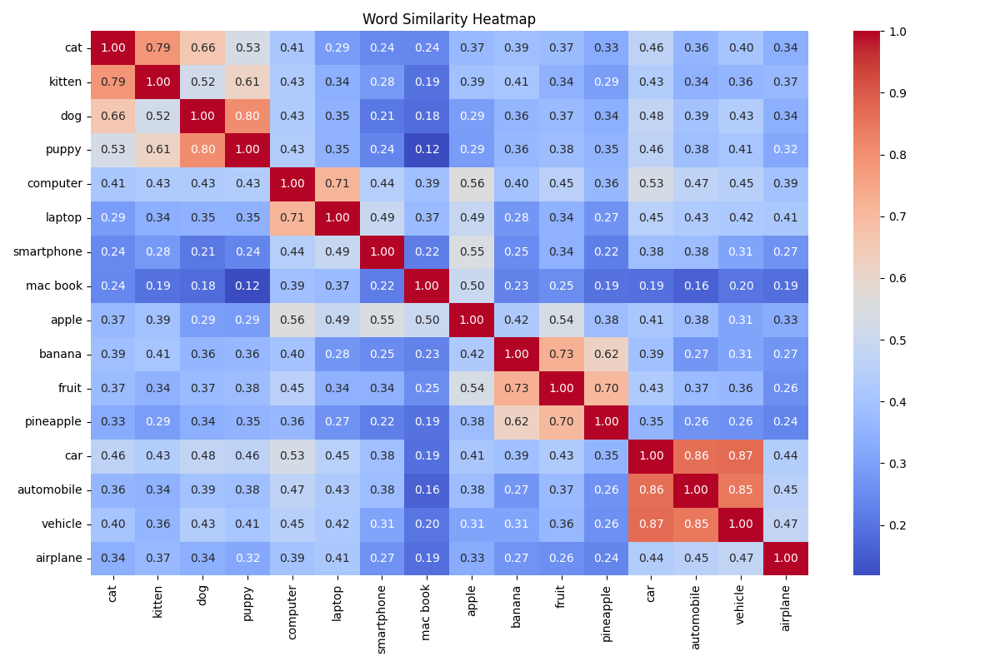

Retrieval-Augmented Generation (RAG) by Kevin Luzbetak
======================================================

RAG system using MongoDB for document storage and sentence-transformers for embeddings.

-----------------------------------------------------------------------------------------------------
## Quick Start

```bash
# Install dependencies
pip install spacy transformers torch networkx fastapi
pip install uvicorn loguru rich pymongo beautifulsoup4
python -m spacy download en_core_web_sm

# Process HTML files
python 2-process-unstructured-html.py -s textrank

# Initialize database (will delete existing data)
# Load documents from data/search-index.json
# Show document count
python 4-init-rag-db.py

# Option 1: API-based search
./5-fastapi-uvicorn-server.sh
python 6-api-rag-search.py

# Option 2: Direct CLI search
python 7-cli-rag-search.py
```

--------------------------------------------------------------------------------------------
## Files

```bash
┌── 2-process-summarize-unstructured-html.py # Process HTML files and generate index
├── 3-document-summarize-validator.py        # Validate and summarize documents
├── 4-initialize-db-load-documents.py        # Initialize MongoDB and store documents
├── 5-cli-rag-search.py                      # Direct CLI search tool
├── 6-run-fastapi-uvicorn-server.sh          # Start FastAPI server
└── 7-api-rag-search.py                      # API-based search tool

┌── ai/                                      # Directory with unstructured HTML files
├── config.py                                # System configuration
├── database.py                              # MongoDB database interactions
├── data_ingestion.py                        # Data loading and preprocessing pipeline
├── vectorization.py                         # Handles document embedding
└── query.py                                 # Search and retrieval engine
```
--------------------------------------------------------------------------------------------
## Default Embedding Model:
The all-MiniLM-L6-v2 is a lightweight and efficient transformer model that's popular for generating sentence embeddings. Here are its key characteristics:

## Architecture all-MiniLM-L6-v2:
Based on MiniLM architecture, which is a distilled version of larger transformer models
6 layers (L6 in the name) making it quite compact
Trained using knowledge distillation from larger models

### Main strengths:
Very fast inference speed due to its small size
Good balance of performance vs computational requirements
Produces 384-dimensional embeddings
Works well for general-purpose sentence similarity tasks

### Compared to alternatives listed:
Faster but slightly lower quality than all-mpnet-base-v2
More general-purpose than multi-qa-MiniLM-L6-cos-v1 which is QA-specific
English-only, unlike the multilingual variant
Similar performance tier to all-distilroberta-v1 but typically faster

### Best suited for:
Production environments where speed is important
Applications with resource constraints
General semantic similarity tasks
Cases where a good speed/performance trade-off is needed

It's often considered a good default choice when you need reliable embeddings without excessive computational overhead. The model strikes a nice balance between efficiency and effectiveness for most common use cases.

### Alternative Embedding Models:
- sentence-transformers/all-MiniLM-L6-v2
- sentence-transformers/all-mpnet-base-v2                      # Better quality, slower
- sentence-transformers/multi-qa-MiniLM-L6-cos-v1              # Optimized for QA
- sentence-transformers/paraphrase-multilingual-MiniLM-L12-v2  # Multilingual
- sentence-transformers/all-distilroberta-v1                   # Good balance of speed/quality

Summarization: TextRank (default), spaCy, BART


## Additional Notes:
- The script uses sentence-transformers for generating embeddings
- Default model: 'sentence-transformers/all-MiniLM-L6-v2'
- Embedding dimension: 384
- MongoDB indices optimize search performance
- Logging is handled by loguru for better debugging


-----------------------------------------------------------------------------------------------------
## Process Unstructured HTML and Summarization
```bash
pip install spacy networkx numpy beautifulsoup4
python -m spacy download en_core_web_sm

# Run with TextRank (default)
python 2-process-unstructured-html.py

# Run with basic summarization
python 2-process-unstructured-html.py --summarize basic 
python 2-process-unstructured-html.py --summarize textrank

# Run with debug logging
python 2-process-unstructured-html.py --debug
```
-----------------------------------------------------------------------------------------------------
## Document Summarization Validation
```bash
python -m spacy download en_core_web_sm

# Basic usage
python document_validator.py

# With specific input/output files
python document_validator.py -i input.json -o output.json

# Debug mode
python document_validator.py --debug

# Basic summarization (default)
python document_validator.py


# Using different summarization methods
python document_validator.py --summarize textrank
python document_validator.py --summarize spacy
python document_validator.py --summarize transformers

```
-----------------------------------------------------------------------------------------------------


