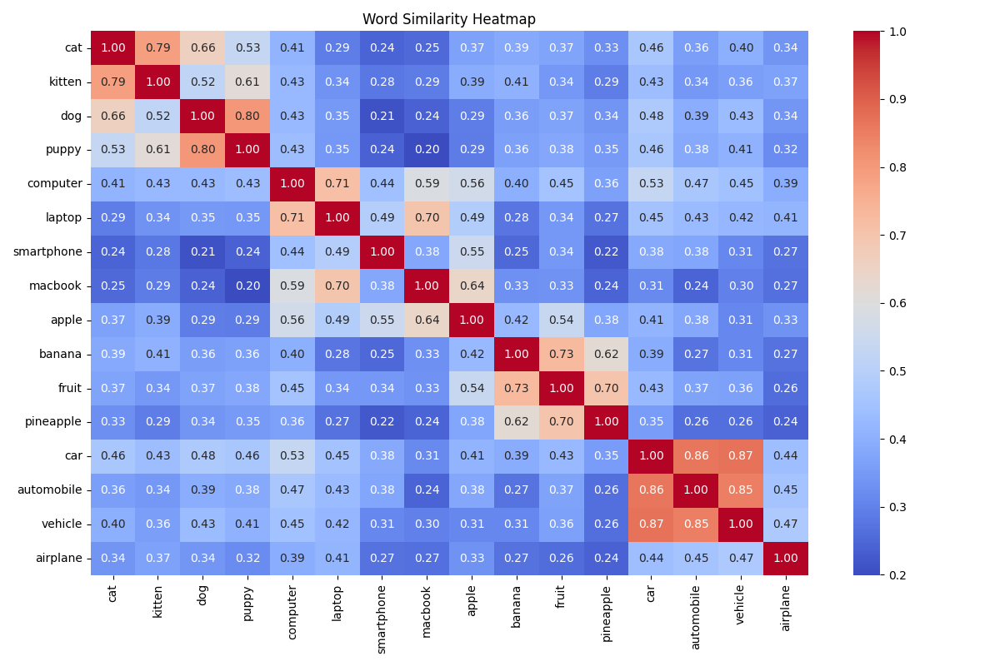

Retrieval-Augmented Generation (RAG) by Kevin Luzbetak
======================================================

RAG system using MongoDB for document storage and sentence-transformers for embeddings.

--------------------------------------------------------------------------------------------
## Quick Start

```bash
# Process HTML files
python 1-process-summarize-unstructured-html.py -s textrank

# Initialize database (delete existing data)
# Load documents from data/search-index.json
./2-document-summarize-validator.py

# Direct CLI search
./4-cli-rag-search.py 
```

--------------------------------------------------------------------------------------------
## Files

```bash
┌── 1-process-summarize-unstructured-html.py # Process HTML files and generate index
├── 2-document-summarize-validator.py        # Validate and summarize documents
├── 3-initialize-db-load-documents.py        # Initialize MongoDB and store documents
├── 4-cli-rag-search.py                      # Direct CLI search tool
├── 5-run-fastapi-uvicorn-server.sh          # Start FastAPI server
└── 6-api-rag-search.py                      # API-based search tool

┌── ai/                                      # Directory with unstructured HTML files
├── config.py                                # System configuration
├── database.py                              # MongoDB database interactions
├── 6ata_ingestion.py                        # Data loading and preprocessing pipeline
├── vectorization.py                         # Handles document embedding
└── query.py                                 # Search and retrieval engine
```
--------------------------------------------------------------------------------------------
## Default Embedding Model:
The all-MiniLM-L6-v2 is a lightweight and efficient transformer model that's popular for generating sentence embeddings. Here are its key characteristics:

## Architecture all-MiniLM-L6-v2:
Based on MiniLM architecture, which is a distilled version of larger transformer models
6 layers (L6 in the name) making it quite compact
Trained using knowledge distillation from larger models

### Main strengths:
Very fast inference speed due to its small size
Good balance of performance vs computational requirements
Produces 384-dimensional embeddings
Works well for general-purpose sentence similarity tasks

### Compared to alternatives listed:
Faster but slightly lower quality than all-mpnet-base-v2
More general-purpose than multi-qa-MiniLM-L6-cos-v1 which is QA-specific
English-only, unlike the multilingual variant
Similar performance tier to all-distilroberta-v1 but typically faster

### Best suited for:
Production environments where speed is important
Applications with resource constraints
General semantic similarity tasks
Cases where a good speed/performance trade-off is needed

It's often considered a good default choice when you need reliable embeddings without excessive computational overhead. The model strikes a nice balance between efficiency and effectiveness for most common use cases.

### Alternative Embedding Models:
- sentence-transformers/all-MiniLM-L6-v2
- sentence-transformers/all-mpnet-base-v2                      # Better quality, slower
- sentence-transformers/multi-qa-MiniLM-L6-cos-v1              # Optimized for QA
- sentence-transformers/paraphrase-multilingual-MiniLM-L12-v2  # Multilingual
- sentence-transformers/all-distilroberta-v1                   # Good balance of speed/quality

Summarization: TextRank (default), spaCy, BART


## Additional Notes:
- The script uses sentence-transformers for generating embeddings
- Default model: 'sentence-transformers/all-MiniLM-L6-v2'
- Embedding dimension: 384
- MongoDB indices optimize search performance
- Logging is handled by loguru for better debugging


-----------------------------------------------------------------------------------------------------
## Process Unstructured HTML and Summarization
```bash
pip install spacy networkx numpy beautifulsoup4
python -m spacy download en_core_web_sm

# Run with TextRank (default)
python 2-process-unstructured-html.py

# Run with basic summarization
python 2-process-unstructured-html.py --summarize basic 
python 2-process-unstructured-html.py --summarize textrank

# Run with debug logging
python 2-process-unstructured-html.py --debug
```
-----------------------------------------------------------------------------------------------------
## Document Summarization Validation
```bash
python -m spacy download en_core_web_sm

# Basic usage
python document_validator.py

# With specific input/output files
python document_validator.py -i input.json -o output.json

# Debug mode
python document_validator.py --debug

# Basic summarization (default)
python document_validator.py


# Using different summarization methods
python document_validator.py --summarize textrank
python document_validator.py --summarize spacy
python document_validator.py --summarize transformers

```
-----------------------------------------------------------------------------------------------------



```bash
+-----------+------------------------------------------------------------------------+
| Field     | Value                                                                  |
+-----------+------------------------------------------------------------------------+
| _id       | 672d49d34d10561a9cda0985                                               |
| url       | https://luzbetak.github.io/ai/NVIDIA-GeForce-                          |
|           | RTX-3060-Installation.html                                             |
| title     | NVIDIA-GeForce-RTX-3060-Installation.html                              |
| content   | geforce rtx 3060 installation install nvidia geforce rtx 3060 for      |
|           | machine learning step 1 prepare your system before installing the      |
|           | nvidia drivers update your system and install the necessary packages   |
|           | sudo apt update sudo apt upgrade install required build tools and      |
|           | headers sudo apt install build essential linux headers uname r step 2  |
|           | install nvidia drivers add the nvidia ppa add the official nvidia ppa  |
|           | to get the latest drivers sudo add apt repository ppa graphics drivers |
|           | ppa sudo apt update identify the r...                                  |
| embedding | [0.0167, -0.0435, -0.0302, -0.0132, -0.0423, -0.0020, -0.0411, 0.0279, |
|           | -0.0827, -0.0402, -0.0400, -0.0681, -0.0791, -0.0032, -0.0268, 0.0215, |
|           | 0.0335, 0.0184, -0.0099, -0.0042, 0.0371, -0.1086, -0.0329, -0.0509,   |
|           | -0.0554, 0.0670, 0.0825, -0.0261, 0.0133, -0.0204, 0.0155, 0.0146,     |
|           | 0.0451, 0.0002, -0.0936, -0.0443, 0.0358, -0.0595, 0.0489, -0.0748,    |
|           | -0.0574, -0.0110, 0.0333, 0.0385, 0.0619, -0.0329, 0.0025, 0.0458,     |
|           | 0.0733, -0.0852, -0.0254, -0.0206, -0.0267, -0.0195, -0.1174, 0.0141,  |
|           | -0.0869, -0.0756, 0.0333, -0.0110, 0.0527, -0.0860, -0.0161, 0.0908... |
|           | (384 total)]                                                           |
+-----------+------------------------------------------------------------------------+
```

